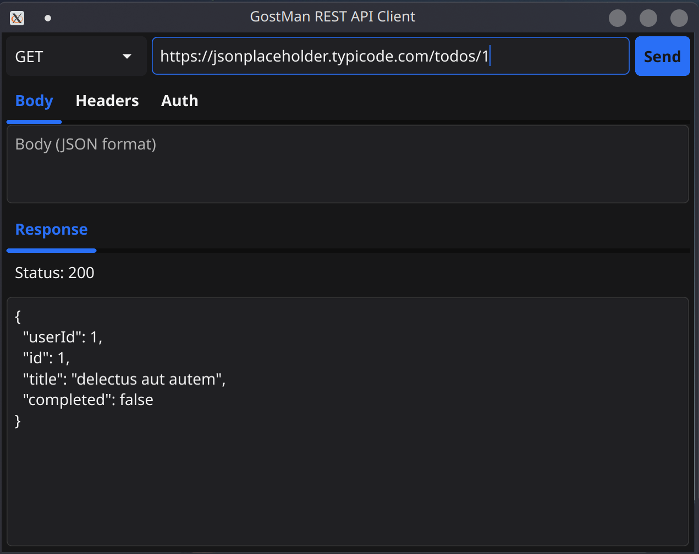
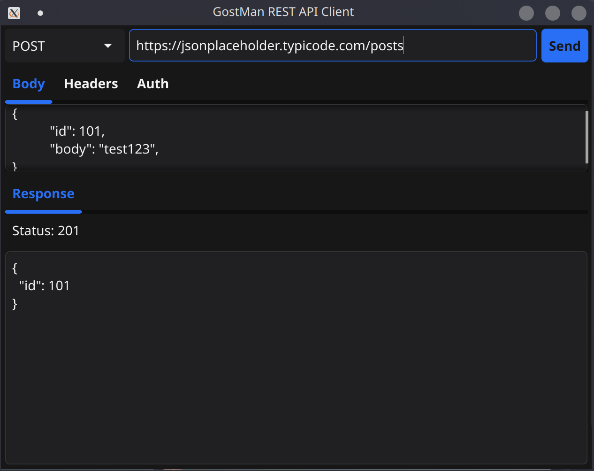

## GostMan - Go REST API Client
GostMan is a lightweight and easy-to-use REST API client written in Go. 

| | |
| ------- | ------- |
|  |  |

### Features
REST Compatible, supports GET, POST, PUT, PATCH, DELETE methods.
Supports customizable headers and query parameters.
Lightweight and easy to use.

### Installation
1. Clone the repositiory
```
git clone https://github.com/DarkMatter-999/GostMan.git
cd GostMan
```

2. Install Dependencies
```
go mod tidy
```

3. Build the Executable
```
go build -o gostman main.go
```

4. Usage
You can now use the gostman binary to interact with REST APIs.


